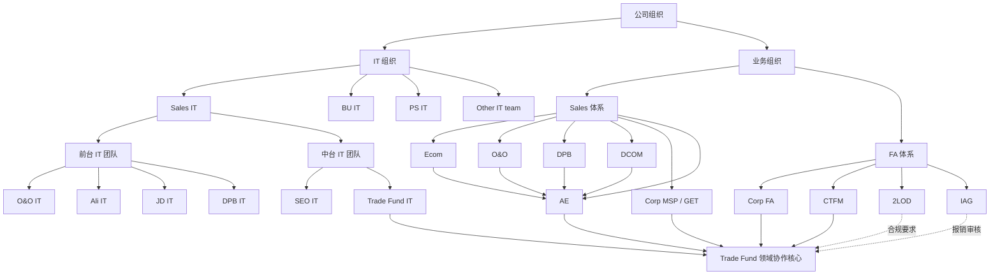

# 模块1 组织架构介绍

## 1. 模块目标

本模块用于帮助接手人快速理解 Trade Fund IT 所处的 IT 组织位置、主要业务 stakeholder、关键协作关系以及各团队在 Trade Fund 领域中的作用。

目标不是单纯记住团队名称，而是理解以下四件事：

- Trade Fund IT 在 IT 组织中属于什么团队。
- Trade Fund 领域涉及哪些核心业务和财务角色。
- 各团队分别在设计、执行、监管、审核中承担什么职责。
- 后续遇到问题时应优先找谁协同。

## 2. 一页总览

Trade Fund IT 直接归属于 Sales IT，属于中台 IT 团队。与单一渠道的前台 IT 不同，Trade Fund IT 服务的是全渠道 Sales、各 customer team 对应的 CTFM，以及 Central Sales 和 Central FA 等中台角色。

Trade Fund 领域本质上是一个跨销售、财务、合规和审计共同参与的管理域。Trade Fund IT 的角色，是连接业务规则、财务规划、系统实现、执行落地和控制要求的中枢支撑团队。

## 3. 组织关系图

可编辑的 draw.io 源文件：组织架构图.drawio

建议使用方式：

- 文档中保留该 Mermaid 版本，便于快速预览。
- 需要汇报、截图或继续编辑时，直接打开同目录下的 draw.io 文件。
- 当前组织图聚焦于组织归属和关键协作关系，因此未将 ITT 作为组织节点放入图中；ITT 作为上游业务输入，单独在本模块后文说明。

## 4. IT 组织定位

### 4.1 IT 组织总体划分

公司 IT 按所服务的业务职能划分，主要包括：

- Sales IT：面向销售和 GTM 相关业务。
- BU IT：面向品牌相关业务。
- PS IT：面向供应链相关业务。

### 4.2 Sales IT 内部结构

Sales IT 内部可分为两类团队：

- 前台 IT 团队：面向具体渠道或前线业务，例如 Ali IT、JD IT，也可按渠道继续细分为 O&O IT、DPB IT 等团队。
- 中台 IT 团队：面向跨渠道共性能力，例如 SEO IT、Trade Fund IT。

除 Sales IT 外，图中也保留了 Other IT team，用于表达公司内还存在其他不直接属于当前交接重点、但客观存在的 IT 条线或团队。

### 4.3 Trade Fund IT 的归属

Trade Fund IT 直接归属于 Sales IT，属于中台 IT 团队。

这一定位意味着：

- 不只服务单一销售渠道。
- 需要服务全渠道共性能力。
- 需要兼顾 central policy 与 frontline execution。
- 需要同时理解业务、财务和控制要求。

## 5. GET team 与 Trade Fund IT 的位置

GET team 全称为 Go to Market Enable Team，是 GTM 相关中台团队的总称。

当前可理解为：

- Corp MSP / GET 是当前图示中最核心的 Sales 中台团队表达。
- Central FA team 也属于 GET 范畴。
- Central IT team 同样属于 GET 范畴。
- Trade Fund IT 属于 Central IT team。

因此，Trade Fund IT 在组织上属于 Sales IT，在业务协作视角上又处于 GET team 的中台协同网络中。

## 6. 核心业务 Stakeholder

### 6.1 Sales 体系

Sales 团队按 channel 划分，主要包括：

- Ecom team
- O&O team
- DPB
- DCOM

除此之外，还有销售中台团队 Corp MSP / GET。该团队是 Trade Fund IT 最核心的业务 stakeholder 之一，负责销售中台的政策、策略以及 Trade Fund 相关设计和 operation。

AE 分布在各销售渠道或 customer team 的执行端，因此在图中与 Ecom、O&O、DPB、DCOM 等渠道存在直接关联。对 Trade Fund IT 来说，AE 不是抽象的单一角色，而是各渠道实际使用流程和系统能力的核心用户群体。

### 6.2 FA 体系

FA 体系主要包括：

- Corp FA
- CTFM
- 2LOD
- IAG

这些角色在 Trade Fund 的规划、执行、监管和审核中分工不同，但共同构成完整的资金管理和控制链路。

在图示上，2LOD 与 IAG 被相邻展示，是为了强调它们在控制和审核链路上的衔接关系；该呈现主要表达职责联系，不单独强调严格的组织汇报关系。

## 7. 关键角色与职责说明

### 7.1 Trade Fund IT

角色定位：Sales IT 下的中台 IT 团队。

核心作用：

- 承接 Trade Fund 业务规则和流程。
- 提供系统能力支撑。
- 协调业务、财务和执行端需求。
- 支撑领域稳定运行。

### 7.2 Corp MSP / GET

角色定位：Sales 中台核心业务团队。

核心作用：

- 负责政策与策略设计。
- 负责 Trade Fund 相关 operation 设计。
- 是 Trade Fund IT 最重要的业务协作方之一。

### 7.3 Corp FA

角色定位：Central 财务管理团队。

核心作用：

- 设置 ITT。
- 从财务角度把控 Trade Fund 资金。
- 提供 central guidance 与监管。

### 7.4 CTFM

角色定位：各 customer team 对应的财务角色。

核心作用：

- 管理各销售渠道的财务执行。
- 管理各渠道的 Trade Fund 情况。
- 对所属渠道的执行结果进行监管。

与 Corp FA 的主要边界：

- Corp FA 负责 central guidance 和监管。
- CTFM 负责具体渠道执行与监管。

### 7.5 2LOD

角色定位：第二道防线，负责合规监督。

介入环节：

- design 阶段提供合规建议和要求。
- 执行阶段监督合规执行。
- 事后监控并分析是否存在不合规情况。

### 7.6 IAG

角色定位：内部审计团队。

介入环节：

- 当 AE 进行 Trade Fund 资金报销时，审核报销材料是否齐全、正确、一致。
- 在控制链路上与 2LOD 前后衔接，但其核心职责仍聚焦于报销材料审核和审计要求落地。

### 7.7 AE

角色定位：分布在各销售渠道或 customer team 的 Sales 代表，也是系统最核心的用户群体之一。

核心作用：

- 承接各渠道/customer team 在 Trade Fund 执行端的具体动作。
- 在实际业务场景中使用 Trade Fund 相关流程。
- 发起或参与相关申请、执行和报销动作。

## 8. ITT 在组织协作中的位置

ITT 全称为 Integrated Trade Term，是 Trade Fund 的源头。

在当前组织架构图中，ITT 未作为组织节点单独展示，因为它本质上不是组织角色，而是 Trade Fund 规划链路中的上游业务输入。

每年由公司管理层确定 ITT 后，才进一步决定 Trade Fund 在各个 customer team 的资金规划。因此，ITT 是整个 Trade Fund 规划链路的上游起点。

它对以下环节产生直接影响：

- central 财务规划
- customer team 资金分配
- 业务执行边界
- 系统承接逻辑

## 9. 核心协作对象

当前最核心的协作对象包括：

- Corp MSP / GET
- Corp FA team
- Customer team 的 AE
- Customer team 的 CTFM

从实际运作上看，Trade Fund IT 既要面向中台设计方，也要面向一线执行方，因此协作链路天然较长。

### 9.1 核心联系人清单

以下联系人用于帮助接手人快速识别各组织的主要协作入口。后续如组织或人员调整，需要及时更新。

| 组织/团队 | 核心联系人 |
| --- | --- |
| Trade Fund IT | Chen Heng(B3), Dalton(B2), Songjun(B2), Kevin Xiao(B2), Gwen Xu(A&T) |
| Corp MSP / GET | Lukas(B4), Echo(B3), Mia Zhang(B3), Junjiang Peng(B2), Vivian Meng(B2), Wenying Zhang(B2) |
| Corp FA | Xie Fei(B3), Jean(B2), Sevena(B2) |
| CTFM | Each team has different SPOC |
| AE | Many |
| 2LOD | Mary Lei(B3), Mi Lan(B3), Nancy Wang(B2) |
| IAG | Mary Lei(B3) |
| Ecom team | Carol Zhao |
| O&O team | Amy Chen |
| DPB | Hazel |
| DCOM | 待补充 |
| Ali IT | Nancy Zhang |
| JD IT | Dapeng Zhang |
| O&O IT | Elise |
| DPB IT | Inder(B4) |
| Other IT team | not important |

补充说明：

- CTFM 按不同 customer team 或渠道分别设置 SPOC，需要后续按 team 继续细化。
- AE 数量较多，当前不适合在组织架构模块逐一列出，后续如需要可按重点渠道补充核心 AE 名单。
- DCOM 联系人目前为空，建议后续补充。

## 10. 组织协作总结

Trade Fund IT 的组织特点可以概括为：

1. 归属于 Sales IT，属于中台 IT 团队。
2. 服务全渠道 Sales、CTFM 以及 Central Sales 和 Central FA。
3. 在业务上与 Corp MSP / GET 协作最紧密。
4. 在财务上与 Corp FA 和 CTFM 协作最紧密。
5. 在控制上需满足 2LOD 和 IAG 的要求。
6. 在执行上需要支撑分布于各渠道/customer team 的 AE 这类核心用户群体。

因此，Trade Fund IT 的本质角色不是单纯系统开发团队，而是跨业务、跨财务、跨控制的中台支撑团队。

## 11. 后续可补充内容

后续可继续补充以下内容，使本模块更完整：

- 关键接口人清单
- 常见协作场景与沟通路径
- 重大问题升级路径
- 组织边界说明
- 典型协作案例
